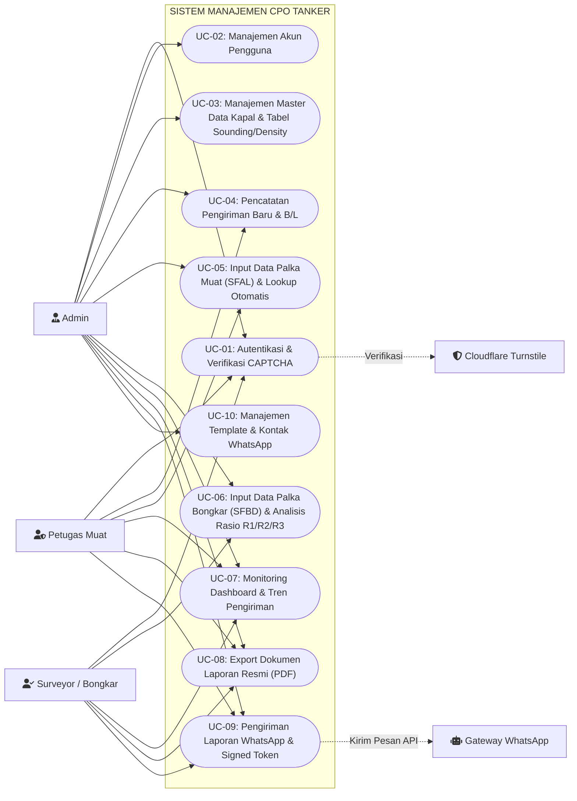
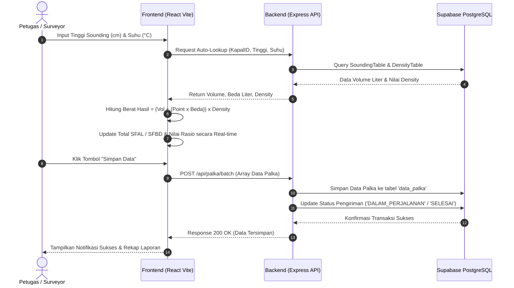
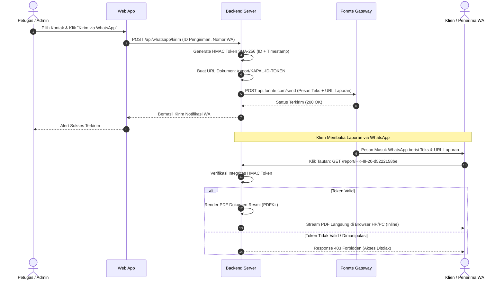
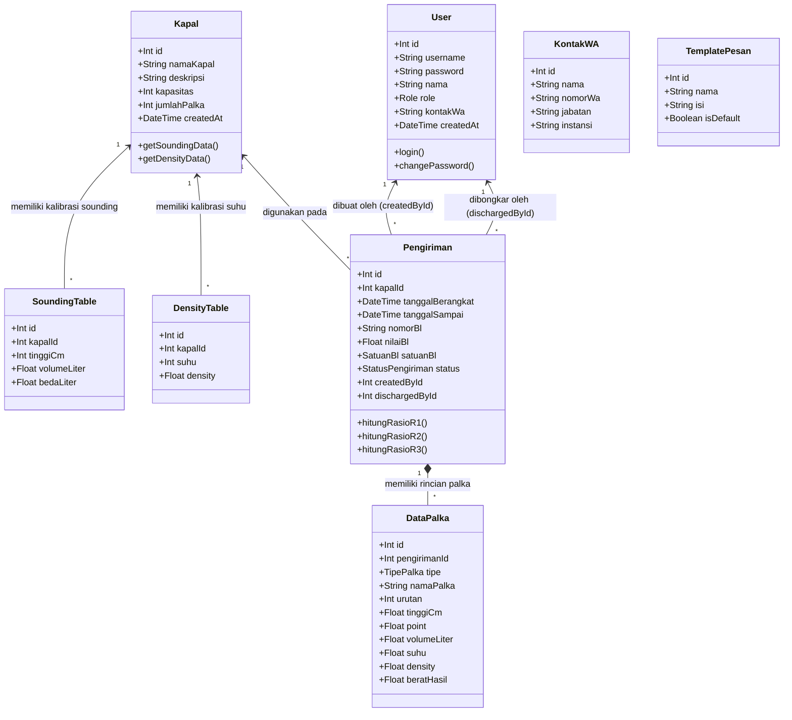
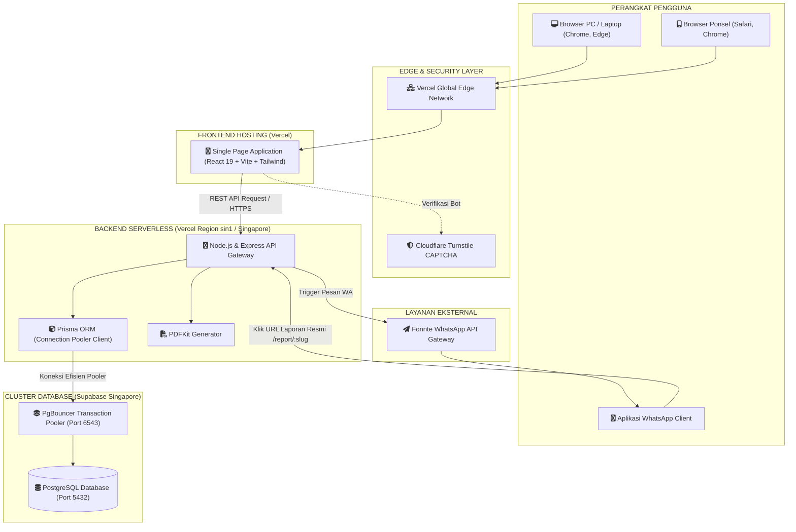

# DOKUMEN SPESIFIKASI SISTEM & DIAGRAM UML
## SISTEM MANAJEMEN PENGIRIMAN & PERHITUNGAN MUATAN CPO (CPO TANKER SHIPPING SYSTEM)

---

## 1. PENDAHULUAN & DESKRIPSI SISTEM

**Sistem Manajemen Pengiriman & Perhitungan Muatan CPO Tanker** adalah aplikasi berbasis web yang dirancang khusus untuk mendigitalkan, mengotomatiskan, dan memvalidasi seluruh rantai proses perhitungan muatan minyak kelapa sawit (*Crude Palm Oil* / CPO) pada kapal tanker/tongkang.

### Tujuan Utama Sistem:
1. **Otomatisasi Perhitungan Palka**: Mengeliminasi kesalahan manual (*human error*) dalam membaca tabel sounding (*Sounding Table*) dan tabel densitas (*Density Table*).
2. **Analisis Rasio & Toleransi Susut**: Menghitung deviasi secara *real-time* antara:
   - **R1**: SFAL (*Ship Figure After Loading*) vs B/L (*Bill of Lading*).
   - **R2**: SFBD (*Ship Figure Before Discharge*) vs SFAL (*Ship Figure After Loading*).
   - **R3**: SFBD (*Ship Figure Before Discharge*) vs B/L (*Bill of Lading*).
3. **Pelaporan Digital Cepat**: Menghasilkan dokumen laporan resmi berformat PDF berstandar maritim dan membagikannya secara instan via WhatsApp Gateway terintegrasi dengan tautan dokumen terenkripsi (*Signed HMAC*).
4. **Keamanan Data**: Dilengkapi perlindungan bot *Cloudflare Turnstile CAPTCHA*, autentikasi JWT berjenjang peran (*Role-Based Access Control*), dan enkripsi data.

---

## 2. IDENTIFIKASI AKTOR & HAK AKSES (ACTOR ROLES)

| No | Aktor (Role) | Deskripsi & Wewenang |
| :---: | :--- | :--- |
| 1 | **ADMIN** | Memiliki akses penuh ke seluruh modul sistem: mengelola akun pengguna, data master kapal, unggah tabel sounding/density via Excel, revisi data pengiriman di semua status, konfigurasi integrasi WhatsApp, dan audit log. |
| 2 | **PETUGAS** *(Petugas Muat / Loading Officer)* | Bertanggung jawab membuat data pengiriman baru, menginput data sounding palka keberangkatan (SFAL), serta mengirim laporan keberangkatan via WhatsApp. |
| 3 | **SURVEYOR** *(Petugas Bongkar / Discharge Officer)* | Bertanggung jawab menginput data sounding palka kedatangan di pelabuhan tujuan (SFBD), memverifikasi analisis susut muatan (R1, R2, R3), dan menyelesaikan status pengiriman. |
| 4 | **GATEWAY WHATSAPP (FONNTE)** *(External System)* | Layanan pihak ketiga yang bertindak mengeksekusi pengiriman pesan otomatis ke nomor WhatsApp para pemangku kepentingan (*stakeholders*). |
| 5 | **CLOUDFLARE TURNSTILE** *(External System)* | Layanan verifikasi keamanan untuk memastikan permintaan login dilakukan oleh manusia asli (bukan serangan bot/brute-force). |

---

## 3. USE CASE DIAGRAM

---

## 4. SPESIFIKASI RINCI USE CASE (USE CASE SPECIFICATIONS)

### UC-01: Autentikasi & Verifikasi CAPTCHA
* **Aktor**: Semua Aktor (Admin, Petugas, Surveyor).
* **Prekondisi**: Pengguna memiliki akun aktif di sistem.
* **Alur Utama**:
  1. Pengguna membuka halaman Login.
  2. Sistem merender formulir username, password, dan widget Cloudflare Turnstile.
  3. Pengguna mengisi username, password, dan menyelesaikan verifikasi Turnstile.
  4. Pengguna menekan tombol "Masuk".
  5. Backend memvalidasi token Turnstile ke Cloudflare API.
  6. Backend memverifikasi hash password di database.
  7. Sistem menerbitkan JWT token dan mengarahkan pengguna ke Dashboard.
* **Alur Alternatif**: Jika CAPTCHA tidak valid atau password salah, sistem menampilkan pesan peringatan dan menolak akses.

---

### UC-03: Manajemen Master Data Kapal & Sounding/Density
* **Aktor**: Admin.
* **Prekondisi**: Admin telah login.
* **Alur Utama**:
  1. Admin membuka menu Master Data / Kapal.
  2. Admin menambahkan data kapal (nama, kapasitas, jumlah palka).
  3. Admin mengunggah berkas Excel berisi Tabel Sounding (*tinggi sounding cm -> volume liter*) dan Tabel Density (*suhu -> densitas*).
  4. Sistem melakukan *batch parsing* dan menyimpan puluhan ribu baris data kalibrasi kapal ke database secara terisolasi per kapal.

---

### UC-05: Input Palka Keberangkatan (SFAL) & Lookup Otomatis
* **Aktor**: Petugas Muat, Admin.
* **Prekondisi**: Data pengiriman telah dibuat dalam status `DRAFT`.
* **Alur Utama**:
  1. Petugas membuka form pengiriman dan memilih tab Keberangkatan.
  2. Petugas menginput tinggi sounding (cm), fraksi point, dan suhu (°C) untuk setiap palka (misal Palka 1P, 1S, 2P, 2S, dst).
  3. Sistem secara otomatis melakukan kalkulasi:
     $$\text{Volume Liter} = \text{Volume Tabel} + (\text{Point} \times \text{Beda Liter})$$
     $$\text{Berat Hasil (KG)} = \text{Volume Liter} \times \text{Densitas Suhu}$$
  4. Sistem menjumlahkan seluruh palka menjadi **Total SFAL (KG)**.
  5. Sistem menghitung selisih dan persentase **R1 (SFAL vs B/L)**.
  6. Petugas menyimpan data. Status pengiriman berubah menjadi `DALAM_PERJALANAN`.

---

### UC-06: Input Palka Kedatangan (SFBD) & Analisis Rasio
* **Aktor**: Surveyor, Admin.
* **Prekondisi**: Status pengiriman berada pada `DALAM_PERJALANAN`.
* **Alur Utama**:
  1. Surveyor membuka halaman pengiriman di pelabuhan tujuan.
  2. Surveyor menginput sounding kedatangan untuk semua palka.
  3. Sistem menghitung **Total SFBD (KG)**.
  4. Sistem menghitung rasio deviasi:
     $$\text{Selisih R2} = \text{SFBD} - \text{SFAL}$$
     $$\text{Persentase R2} = \frac{\text{SFBD} - \text{SFAL}}{\text{SFAL}} \times 100\%$$
     $$\text{Selisih R3} = \text{SFBD} - \text{B/L}$$
     $$\text{Persentase R3} = \frac{\text{SFBD} - \text{B/L}}{\text{B/L}} \times 100\%$$
  5. Sistem menampilkan indikator visual (toleransi susut normal $\le 0.5\%$, waspada jika $> 0.5\%$).
  6. Surveyor menyimpan data. Data palka tersimpan ke database dan status pengiriman diperbarui menjadi `SELESAI`.

---

### UC-08 & UC-09: Dokumen PDF Resmi & Pengiriman WhatsApp
* **Aktor**: Admin, Petugas, Surveyor.
* **Alur Utama**:
  1. Pengguna membuka modal "Kirim Laporan via WhatsApp".
  2. Sistem menyusun teks laporan otomatis berdasarkan template aktif dan menyertakan tautan dokumen resmi terenkripsi:  
     `https://domain.com/report/{NAMA_KAPAL}-{ID}-{HMAC_TOKEN}`
  3. Pengguna memilih kontak penerima dan menekan "Kirim via WhatsApp".
  4. Backend mengirim pesan ke nomor tujuan melalui Fonnte API Gateway.
  5. Penerima di WhatsApp menerima laporan dan dapat langsung mengklik tautan dokumen untuk membuka/mengunduh PDF laporan resmi tanpa perlu login.

---

## 5. ACTIVITY DIAGRAM (ALUR PROSES BISNIS END-TO-END)

```mermaid
stateDiagram-v2
    [*] --> Login: Pengguna Mengakses Sistem
    Login --> VerifikasiCaptcha: Submit Kredensial & Turnstile
    VerifikasiCaptcha --> Dashboard: Sukses Autentikasi

    state "Fase Pelabuhan Muat (Departure)" as Muat {
        Dashboard --> BuatPengiriman: Input Data Awal (Kapal, Tanggal, No. BL, Nilai BL)
        BuatPengiriman --> InputPalkaSFAL: Input Sounding & Suhu Palka
        InputPalkaSFAL --> KalkulasiSFAL: Lookup Otomatis Tabel Sounding & Density
        KalkulasiSFAL --> SimpanSFAL: Simpan Data Palka (Status: DALAM_PERJALANAN)
        SimpanSFAL --> KirimWASFAL: Kirim Laporan Keberangkatan via WhatsApp
    }

    state "Fase Berlayar" as Berlayar {
        KirimWASFAL --> MonitoringKapal: Monitoring di Dashboard & List Pengiriman
    }

    state "Fase Pelabuhan Bongkar (Arrival)" as Bongkar {
        MonitoringKapal --> InputPalkaSFBD: Kapal Tiba di Tujuan
        InputPalkaSFBD --> KalkulasiSFBD: Input Sounding & Hitung Berat Kedatangan
        KalkulasiSFBD --> AnalisisRasio: Komparasi R1 (SFAL vs BL), R2 (SFBD vs SFAL), R3 (SFBD vs BL)
        AnalisisRasio --> ValidasiSusut: Evaluasi Toleransi Deviasi Muatan
        ValidasiSusut --> SimpanSelesai: Simpan Palka Kedatangan & Ubah Status (SELESAI)
        SimpanSelesai --> GeneratePDF: Terbitkan Laporan Resmi (PDF)
        GeneratePDF --> KirimWASelesai: Kirim Laporan Final via WhatsApp dengan Signed Link
    }

    KirimWASelesai --> [*]: Selesai
```

---

## 6. SEQUENCE DIAGRAM

### A. Sequence Diagram: Perhitungan Palka & Auto-Lookup

---

### B. Sequence Diagram: Pengiriman WhatsApp & Download Dokumen Publik (Signed URL)

---

## 7. CLASS DIAGRAM (STRUKTUR DATA & ENTITAS)

---

## 8. DEPLOYMENT DIAGRAM (ARSITEKTUR CLOUD & INFRASTRUKTUR)

---

## 9. KESIMPULAN & RINGKASAN KEUNGGULAN SISTEM

Dokumen arsitektur dan diagram UML di atas merangkum seluruh kemampuan sistem CPO Tanker yang siap diserahkan kepada klien:
1. **Ketepatan Hitung Terjamin**: Otomatisasi pembacaan tabel sounding dan densitas menghasilkan perhitungan yang akurat dan dapat dipertanggungjawabkan.
2. **Keamanan Maksimal**: Perlindungan ganda dengan *Cloudflare Turnstile*, otorisasi *Role-Based Access Control*, dan pengamanan URL dokumen via *HMAC SHA-256 Token*.
3. **Infrastruktur Modern**: Dirancang di atas arsitektur *Cloud Serverless* di kawasan Singapura (`sin1`) yang menghadirkan kecepatan respon tinggi (< 15ms), tahan lonjakan beban (*auto-scaling*), dan keandalan tinggi (99.9% *uptime*).
